# eBook App

eBook App is a full-stack web application for creating, editing, and exporting eBooks with AI-powered assistance. It features a modern React frontend, Node.js/Express backend, MongoDB database, and integration with Google Gemini AI for book outline generation.

---

## Table of Contents

1. [Project Overview](#project-overview)
2. [System Architecture](#system-architecture)
3. [Database Model](#database-model)
4. [Use Case Diagram](#use-case-diagram)
5. [Setup & Installation](#setup--installation)
6. [How to Use](#how-to-use)
7. [API & Features](#api--features)
8. [Contributing](#contributing)
9. [License](#license)

---

## Project Overview

eBook Forge enables users to:

- Sign up, log in, and manage their profile
- Create, edit, and organize eBooks with chapters
- Use AI to generate book outlines
- Export eBooks to PDF or DOCX
- Store book covers and content securely

---

## System Architecture
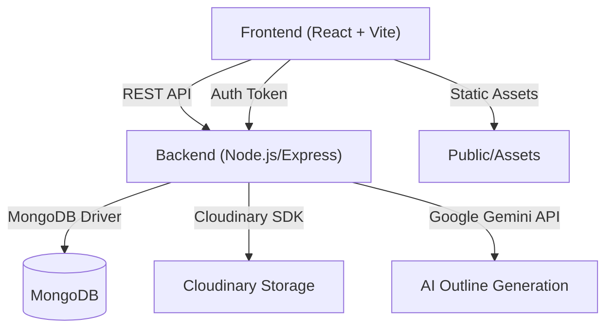

---

## Developer Diagrams
---

### 5. Folder Structure
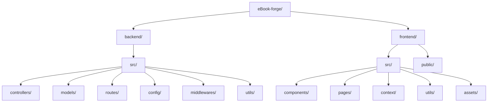

### 6. Class Diagram (Backend Models)
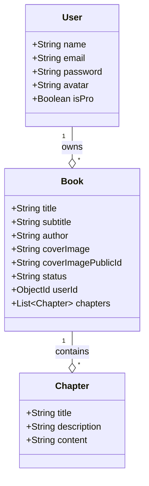

### 7. State Diagram (Book Status)
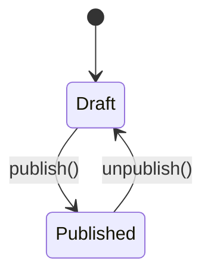

### 8. Component Diagram
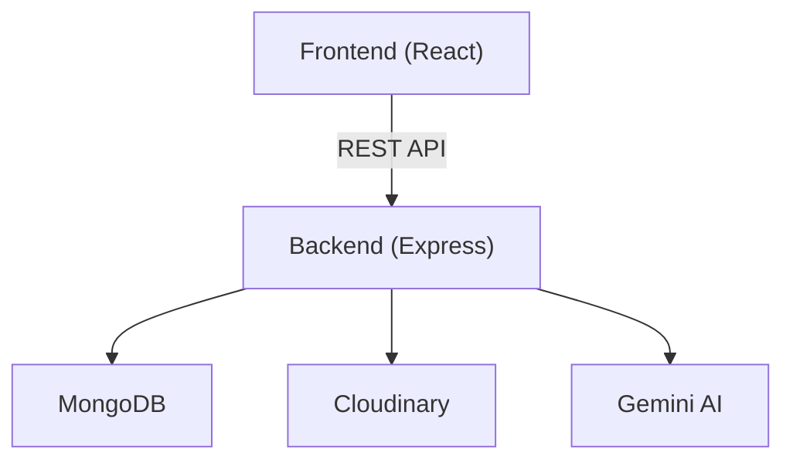

### 9. Deployment Diagram
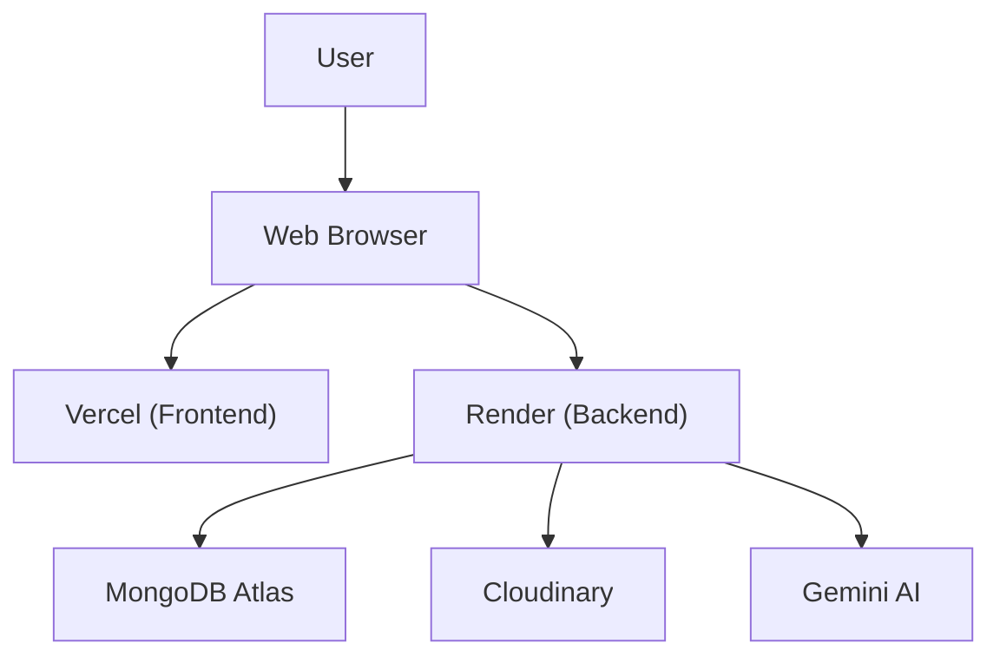

### 10. Activity Diagram (Book Creation)
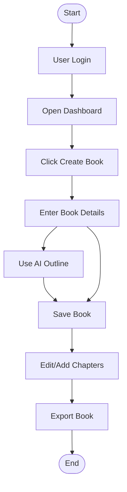

### 11. API Contract Diagram (Sample)
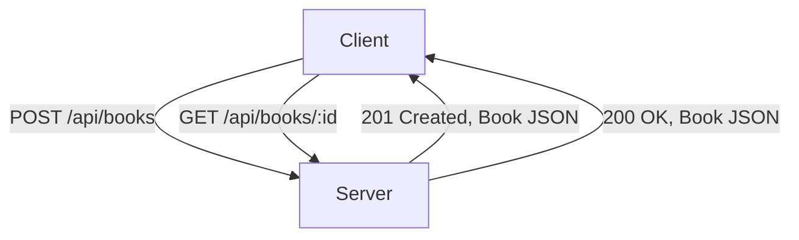

### 12. Data Flow Diagram
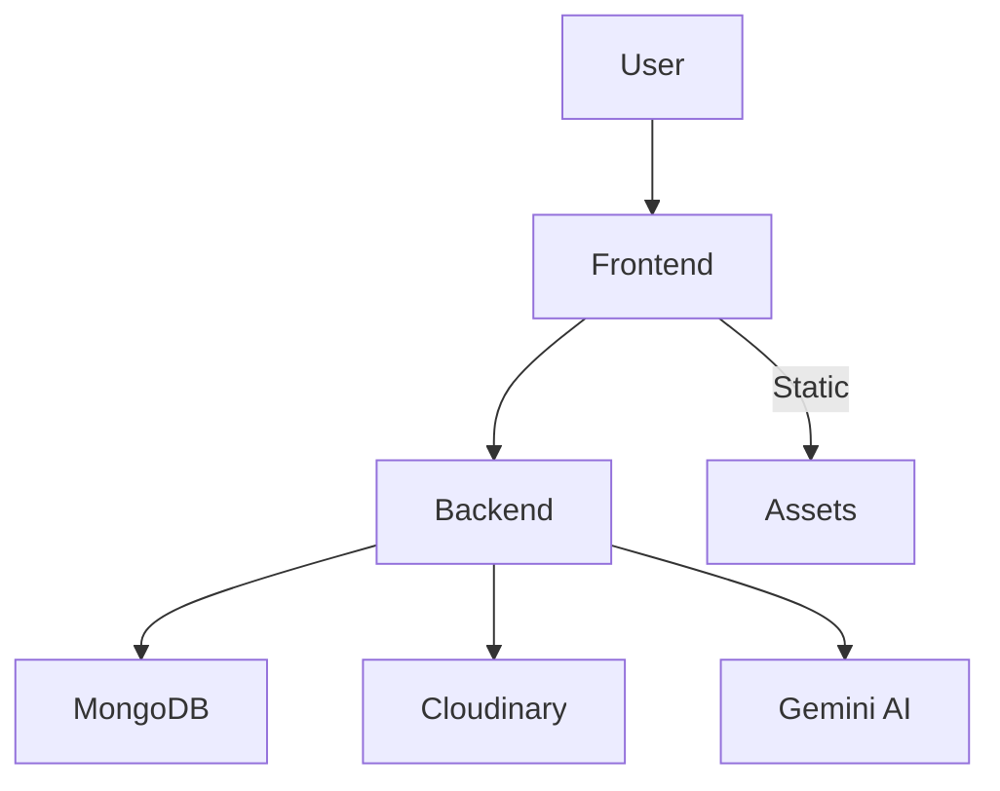

### 1. Backend Route Structure
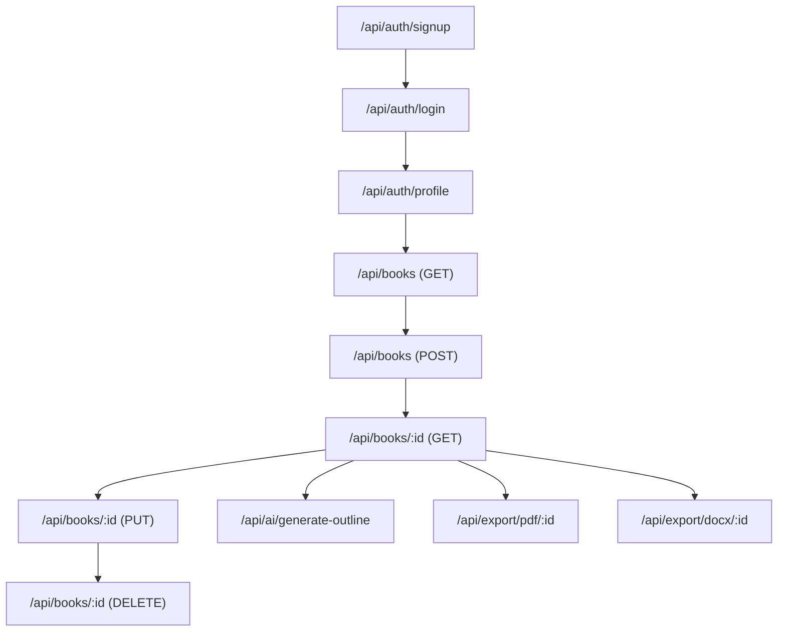

### 2. Frontend Component Hierarchy
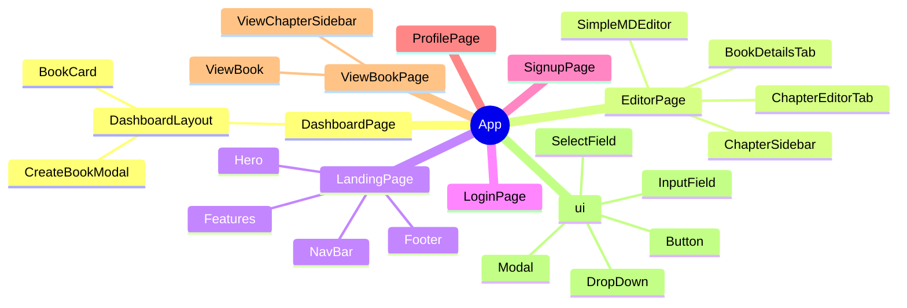

### 3. API Request Flow
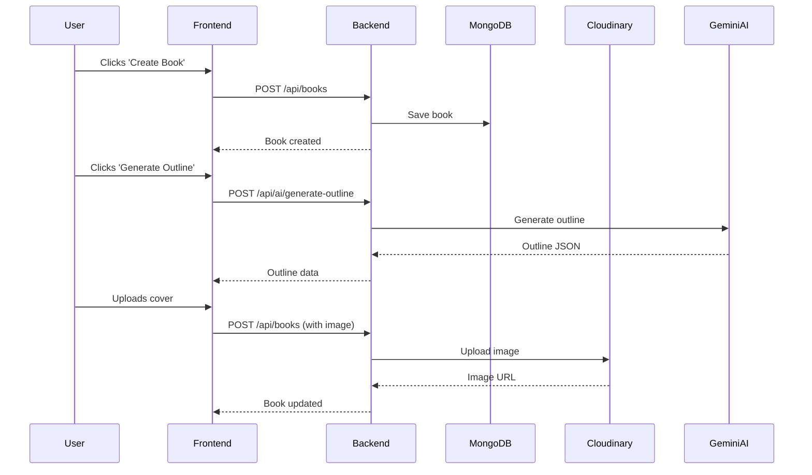

### 4. Deployment/DevOps Overview
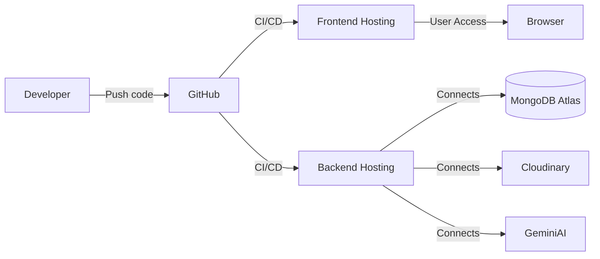

---

## Database Model

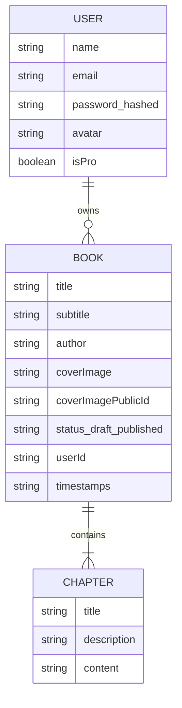

---

## Use Case Diagram

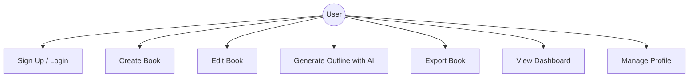

---

## Setup & Installation

### Prerequisites

| Requirement   | Version/Notes           |
|--------------|------------------------|
| Node.js      | >= 18.x                |
| npm          | >= 9.x                 |
| MongoDB      | Cloud/local instance   |
| Cloudinary   | Account & API keys     |
| Google Gemini| API key                |

### 1. Clone the Repository

```sh
git clone https://github.com/Mr-Aniket-Gupta/eBook-forge.git
cd eBook-forge
```

### 2. Backend Setup

```sh
cd backend
npm install
```

Create a `.env` file in `backend/` with:

```env
PORT=4000
MONGO_URI=your_mongodb_uri
JWT_SECRET=your_jwt_secret
CLOUDINARY_CLOUD_NAME=your_cloud_name
CLOUDINARY_API_KEY=your_api_key
CLOUDINARY_API_SECRET=your_api_secret
GEMINI_API_KEY=your_gemini_api_key
```

Start the backend server:

```sh
npm server.js
# or
nodemon server.js
```

### 3. Frontend Setup

```sh
cd ../frontend
npm install
npm run dev
```

The frontend will run on [http://localhost:5173](http://localhost:5173)

---

## How to Use

### For Non-Coders

1. **Sign Up/Login:** Create an account or log in.
2. **Dashboard:** View your books and create a new one.
3. **Create Book:** Enter book details, add chapters, or use AI to generate an outline.
4. **Edit Book:** Edit chapters, reorder, and update content.
5. **Export:** Download your book as PDF or DOCX.

### For Developers

- Use the REST API for custom integrations (see API table below).
- Extend frontend components in `frontend/src/components`.
- Backend endpoints in `backend/src/routes`.

---

## API & Features

### Main API Endpoints

| Endpoint                | Method | Description                  | Auth Required |
|-------------------------|--------|------------------------------|---------------|
| /api/auth/signup        | POST   | Register new user            | No            |
| /api/auth/login         | POST   | Login user                   | No            |
| /api/auth/profile       | GET    | Get user profile             | Yes           |
| /api/books              | GET    | Get all books (user)         | Yes           |
| /api/books              | POST   | Create new book              | Yes           |
| /api/books/:id          | GET    | Get book by ID               | Yes           |
| /api/books/:id          | PUT    | Update book                  | Yes           |
| /api/books/:id          | DELETE | Delete book                  | Yes           |
| /api/ai/generate-outline| POST   | Generate book outline (AI)   | Yes           |
| /api/export/pdf/:id     | GET    | Export book as PDF           | Yes           |
| /api/export/docx/:id    | GET    | Export book as DOCX          | Yes           |

### Key Features Table

| Feature                | Description                                  |
|------------------------|----------------------------------------------|
| AI Outline Generation  | Generate book structure using Google Gemini   |
| Cloud Storage          | Book covers/images stored on Cloudinary      |
| Export Formats         | Download as PDF or DOCX                      |
| Auth & JWT             | Secure login and protected routes            |
| Responsive UI          | Modern, mobile-friendly React interface      |

---

## Contributing

1. Fork the repo and create your branch.
2. Commit your changes and push.
3. Open a Pull Request.

---

## License

ISC License. See [LICENSE](LICENSE) for details.
